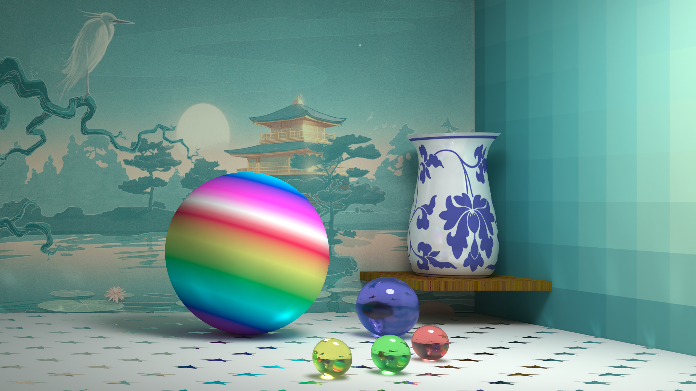
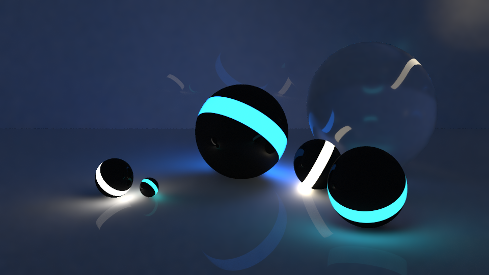
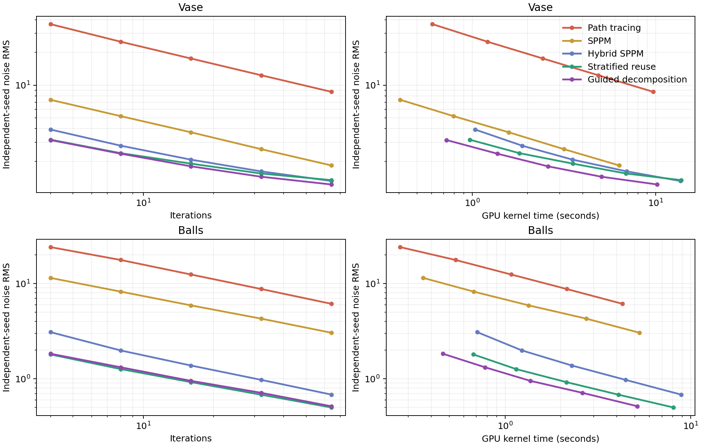

# Computational Graphics - THU Spring 2018


## HW1(10')

实现一个感兴趣的光栅图形学算法

| 基本选题      | 加分项                                                     |
| ------------- | ---------------------------------------------------------- |
| 画线(6')      | SSAA(2'), Kernel(2'), 区域采样(2'), 相交线反走样的case(4') |
| 画弧(8')      | 同上                                                       |
| 区域填充(10') | 边界反走样(2')                                             |

### Result

图太丑了而且这个作业也很trivial就不放图了

## HW2(60')

参数曲线/曲面的三维造形与渲染

- 利用参数曲线/曲面凹一个造型
- 渲染
  - 基本：光线与参数曲线/曲面的求交
  - 其他：光子映射，加速，纹理景深，体积光等等

### Scoring

```
占总评60分，按以下算法得出分值后，和全班一起归一化到70~100作为单项成绩。(负分倒扣, BUG倒扣)

基本功能完整性[-20, 0]: 光线跟踪基本结果，反射折射阴影
实现网格化求交: [-5]	
实现参数曲面求交: [0, 10]: 解方程请写出求解过程，其他请写出迭代过程
算法选型[0, 40]: 需要实现对应效果才为有效
参考基准: PT: 15, DRT: 25, PM: 30, PPM: 30.
DRT请在报告中注明使用的函数
加速[0, 10]: 算法型加速为有效
OpenMP: 2, GPU: 5
景深/软阴影/锯齿/贴图等[0,5]
主观分[-10, 10]: 设计和构图
其他额外效果: 凹凸贴图、体积光等: [5, ?]
```

代码基于 smallpt，实现路径追踪（PT）、随机渐进式光子映射（SPPM）、CUDA Hybrid SPPM、分层复用 Hybrid SPPM，以及直接光分解和低差异引导的 Guided Hybrid SPPM。原始花瓶场景与原 `balls` 分支的玻璃球场景现在都在 `master`，通过 `--scene vase` / `--scene balls` 直接切换，不需要 checkout 其他分支。旋转 Bezier 曲面、彩色纹理、镜面反射、玻璃折射和光源构图均保留原始设定。课程报告见 [hw2/report.pdf](hw2/report.pdf)。

### 直接渲染结果

下图均为渲染器直接输出的原始颜色，仅将 PPM 无损转换成 PNG，没有 Photoshop 调色、改曝光或手工修图。

**花瓶：**



**Balls：**


### 新算法：Guided Hybrid SPPM

直接 PT 从相机随机寻找光源，漫反射表面上的大部分路径贡献很小；传统 SPPM 能稳定找到焦散，但容易把镜面高光和清晰倒影混进光子半径，或者把大量阴影样本浪费在看不见的光源上。新算法把同一条光传输积分拆成适合不同采样器的部分：

$$L_o = L_{\mathrm{diffuse,SPPM}} + L_{\mathrm{specular,PT}} + L_{\mathrm{direct,NEE}}.$$

1. **GPU 光子映射负责漫反射和焦散。** 相机可见点与光子落点进入空间哈希，通过同一物体、法线和搜索半径汇合；每个像素独立更新半径及累计通量。球形和盒形光源按面积与发光功率采样，玻璃界面使用正确的 $\eta^2$ 传输 Jacobian，因此玻璃球内的五个光源也能贡献折射和焦散。
2. **镜面与折射使用条件分层 PT。** 对 `specular=0.01` 之类的稀有 BSDF 分量直接单独采样，再乘回它的真实权重，不必等待普通路径以 1% 概率碰巧撞上它。地板倒影、玻璃边缘和花瓶高光独立累积，不会被 SPPM 的汇合半径抹糊。
3. **直接光照只采样真正可见的光源。** 玻璃壳里的灯仍进入光子分布，但不会出现在必定被外壳遮挡的 next-event-estimation 分布中；盒形灯只采样朝向着色点的面，并补偿正确 PDF。这样同等阴影射线数量能得到更多有效贡献。
4. **直接对光路的重要随机变量分层。** 光子按照功率分层选择光源，避免五个球内光源在某一轮碰巧采样失衡；花瓶一类混合材质对漫反射/镜面选择做随机分层，不再完全依赖 Bernoulli 碰运气。玻璃则将菲涅耳分支概率从 $0.25+0.5F$ 改成 $0.1+0.8F$，并保留 $F/p$ 和 $(1-F)/(1-p)$ 的权重补偿：更少时间浪费在低贡献的内部反射上，积分本身不变。
5. **让每个有效样本服务相近的着色点。** 漫反射先拆出反照率，再按物体 ID、法线、几何位置和纹理颜色进行两轮照度复用；镜面和玻璃另外进行两轮局部方差引导的复用，高光、地板倒影和条纹边界各自隔离。邻域复用是明确的偏差—方差折中，不会假装是无偏 ReSTIR；光源分层、BSDF 分层和菲涅耳 PDF 补偿保持原估计量。
6. **把平面光子查询从 27 格降到 9 格。** 对盒体平面先用几何面的精确坐标统一空间哈希，再只查询沿切平面的 3×3 邻域。先做坐标统一很重要：如果直接删掉法线方向的邻居，刚好落在哈希格边界的光子会消失，画面会变暗。球体和曲面仍保留原来的 27 格查询。
7. **用独立随机种子衡量真实噪声。** 旧参考图本身也有随机颗粒，逐像素逼近它并不能说明收敛更快。对两个独立结果使用 $\sigma \approx \sqrt{\mathbb{E}[(I_1-I_2)^2]/2}$；四个及以上 seed 直接计算每个像素的样本标准差。花纹、反射、高光等稳定结构自动抵消，同时记录区域平均亮度和边缘梯度，防止通过调暗或者抹掉细节“降低噪声”。

换句话说，速度提升来自**减少无效光路、降低 estimator 方差、复用兼容样本并加速光子查询**，不是换掉场景、暗化画面或者把高光统一涂抹。实现见 [hw2/sppm/cuda.cu](hw2/sppm/cuda.cu)，完整实验脚本见 [hw2/sppm/benchmark.py](hw2/sppm/benchmark.py)。

#### 再往前一步：从光传输积分减少无效工作

对上一版 `--reuse` 做 Nsight profile 后，花瓶的 GPU 时间中 55% 是镜面/折射路径、45% 是光子；balls 是 53% 光子、40% 镜面/折射、6% 弱镜面。两轮空间重建合计不到 0.1%。因此继续调整后处理核不会带来速度突破；真正的问题是同一份直接光被低效光子估计，以及大量低贡献光子在场景里反弹太久。

`--guided` 在已有分层复用之上增加三项改变：

1. **无重叠地分解直接光与间接光。** 对存在外露光源的场景，摄像机可见点使用 next-event estimation 直接连接面积光；该光源的第一跳 diffuse 光子不再进入 photon gather。这样 $L_{\mathrm{direct}}$ 不会被算两次，光子预算专门留给间接照明、折射和焦散。被玻璃包住的光源仍使用完整光子路径，不会被错误当作可见面积光。
2. **四维随机化低差异发光。** 对每个光子联合分层光源表面的两个坐标和余弦半球方向的两个坐标；每轮、每个 seed 都有独立 Cranley–Patterson 随机旋转。与互相独立的随机数相比，同样数量的光子能更均匀地覆盖发光位置与出射方向，同时保持正确的发射分布。
3. **只对光子提前做无偏 Russian roulette。** 摄像机侧的反射、玻璃和花瓶高光仍完整追踪；低贡献光子从第一跳后开始按材质反照率决定是否继续，存活路径乘回 $1/p_{\mathrm{survive}}$。改变的是路径长度的计算成本，不是光传输积分或场景颜色。

光源是否外露、低差异序列以及 Russian roulette 生存概率都由场景几何和材质自动决定，不识别特定场景名称、固定颜色或贴图文件。constant memory、可见对象 bitmask、把大球近似成平面，以及对玻璃分支强行分层也都做过实测，但分别造成访存串行化、额外同步或方差升高，因此没有放进最终实现。

#### 同场景渲染对比

下面的图使用相同场景、相机、光源和原始颜色；PT、普通 SPPM 与 Hybrid SPPM 分别单独直接渲染，不做后期调色。

| 算法 | 花瓶 | Balls |
| --- | --- | --- |
| CUDA PT |  |  |
| CUDA SPPM |  |  |
| CUDA Hybrid SPPM |  |  |
| CUDA 分层复用 Hybrid SPPM |  |  |
| CUDA Guided Hybrid SPPM |  |  |

以上对比图分辨率均为 960×540；PT 使用每子像素 64 次采样，四种 SPPM 均使用 48 轮，花瓶每轮每像素 5 个光子、balls 每轮每像素 8 个光子。因为五种 estimator 的计算量不同，图片仅展示各自固定参数下的直接渲染效果；迭代次数、实际时间和独立 seed 噪声的严格对比见下表。

#### 200 次直接渲染的收敛基准

测试使用一张 NVIDIA H200、640×360 分辨率、五种算法、四个独立随机种子，以及 4、8、16、32、64 五个迭代档位，共 200 次独立直接渲染。PT 的“16 轮”等价于每子像素 128 次采样；其他算法是 16 轮光子映射。每个场景分别在五个固定区域测量 8-bit 亮度的跨 seed RMS，并对五个区域取 RMS 作为综合噪声；CUDA event 只统计 GPU kernel 时间，不包括 CUDA 初始化、贴图上传或图像写出。



**16 轮、四个独立随机种子：**

| 场景 | 算法 | GPU kernel | 综合噪声 RMS | 重点区域 A | 重点区域 B |
| --- | --- | ---: | ---: | ---: | ---: |
| 花瓶 | PT | 2.429 s | 17.615 | 白瓷 18.721 | 蓝花 19.021 |
| 花瓶 | SPPM | 1.581 s | 3.699 | 白瓷 4.056 | 蓝花 4.932 |
| 花瓶 | Hybrid SPPM | 3.527 s | 2.073 | 白瓷 2.179 | 蓝花 2.045 |
| 花瓶 | 分层复用 Hybrid | 3.535 s | 1.905 | 白瓷 1.958 | 蓝花 1.862 |
| 花瓶 | **Guided Hybrid** | **2.587 s** | **1.800** | 白瓷 2.085 | 蓝花 **1.862** |
| Balls | PT | 1.078 s | 12.447 | 背景 13.898 | 玻璃 16.470 |
| Balls | SPPM | 1.341 s | 5.901 | 背景 6.131 | 玻璃 6.129 |
| Balls | Hybrid SPPM | 2.291 s | 1.379 | 背景 1.315 | 玻璃 1.934 |
| Balls | 分层复用 Hybrid | 2.139 s | **0.923** | 背景 **0.883** | 玻璃 **0.999** |
| Balls | **Guided Hybrid** | **1.367 s** | 0.952 | 背景 1.037 | 玻璃 1.044 |

**三代 Hybrid 算法的完整迭代曲线：**

| 场景 | 迭代 | 旧 Hybrid 噪声 / 时间 | 分层复用噪声 / 时间 | Guided 噪声 / 时间 |
| --- | ---: | ---: | ---: | ---: |
| 花瓶 | 4 | 3.921 / 1.037 s | 3.163 / 0.969 s | **3.138 / 0.725 s** |
| 花瓶 | 8 | 2.786 / 1.871 s | 2.379 / 1.807 s | **2.351 / 1.372 s** |
| 花瓶 | 16 | 2.073 / 3.527 s | 1.905 / 3.535 s | **1.800 / 2.587 s** |
| 花瓶 | 32 | 1.618 / 6.951 s | 1.546 / 6.895 s | **1.444 / 5.060 s** |
| 花瓶 | 64 | 1.320 / 13.620 s | 1.344 / 13.746 s | **1.226 / 10.193 s** |
| Balls | 4 | 3.089 / 0.708 s | **1.802** / 0.675 s | 1.833 / **0.462 s** |
| Balls | 8 | 1.984 / 1.234 s | **1.265** / 1.146 s | 1.322 / **0.779 s** |
| Balls | 16 | 1.379 / 2.291 s | **0.923** / 2.139 s | 0.952 / **1.367 s** |
| Balls | 32 | 0.975 / 4.457 s | **0.681** / 4.086 s | 0.713 / **2.605 s** |
| Balls | 64 | 0.683 / 8.880 s | **0.500** / 8.084 s | 0.515 / **5.163 s** |

固定质量下可以用 $\sigma^2 t$ 比较方差—时间成本，越低越好。16 轮时，花瓶的成本从旧 Hybrid 的 15.155、分层复用的 12.830 降到 Guided 的 8.383，分别提升 **1.81×** 和 **1.53×**；balls 从 4.356、1.822 降到 1.239，分别提升 **3.52×** 和 **1.47×**。balls 达到综合噪声 RMS < 1 时，旧 Hybrid 需要 32 轮 / 4.457 s，分层复用需要 16 轮 / 2.139 s，Guided 同样只需要 16 轮，但耗时进一步降到 **1.367 s**。花瓶达到 RMS < 1.5 时，前两代都需要 64 轮，而 Guided 在 **32 轮 / 5.060 s** 就能达到。

按 $\sigma \propto n^{-p}$ 拟合 4–64 轮，花瓶上旧 Hybrid / 分层复用 / Guided 分别为 $p=0.393/0.309/0.341$，balls 分别为 $p=0.538/0.459/0.455$。算法没有突破 Monte Carlo 的渐近阶数；收益来自更小的方差常数、更短的无效光子路径，以及同样时间下能跑更多轮。balls 同迭代的背景噪声会略高于分层复用，但整体方差—时间成本更低，不能把“更快”和“每轮每个区域都更干净”混为一谈。

颜色与细节同时作为约束：16 轮时，分层复用 → Guided 的 balls 背景亮度 49.27 → 49.28，花瓶整体亮度 128.57 → 128.58，蓝色花纹亮度同为 175.61；彩色条纹边缘梯度同为 430.30，地板倒影边缘 153.65 → 153.74，玻璃边缘 54.16 → 54.02。花瓶地板亮度 166.38 → 166.98，来自直接光照改用 NEE 而不是后期调色。完整原始指标见 [docs/render/convergence.csv](docs/render/convergence.csv)，可运行下文的 `benchmark.py` 原样复现。

在一张 NVIDIA H200 上，以 640×360 分辨率对比 16 线程 CPU：

| 模式 | CPU 总耗时 | GPU kernel | GPU 总耗时 |
| --- | ---: | ---: | ---: |
| PT，每子像素 8 次采样 | 2.399 s | 0.096 s | 0.741 s |
| SPPM，4 轮，每轮每像素 4 个光子 | 30.586 s | 3.363 s | 4.028 s |

GPU 总耗时包含 CUDA 初始化、贴图上传和图像写出。1920×1080 下，以独立 seed 差分估计 8-bit 亮度 RMS：花瓶白瓷 0.36、蓝色花纹 0.26；balls 背景 0.24、地板 0.22、倒影 0.23、玻璃 0.25。上述低噪声结果分别合并 2 个和 3 个独立 seed；页面顶部展示的是单次直接渲染，不依赖后期修图。

### 编译 CPU backend

进入贴图所在目录后编译：

```bash
cd hw2/sppm
g++ -O3 -fopenmp main.cpp -o render
```

macOS 自带的 Apple Clang 不支持 OpenMP，可以使用 Homebrew GCC：

```bash
brew install gcc
/opt/homebrew/bin/g++-15 -O3 -fopenmp main.cpp -o render
```

CPU PT 支持两个场景，默认是 `vase`：

```bash
# 宽度 高度 输出文件 每子像素采样数 [--scene vase|balls]
./render 640 480 vase-cpu-pt.ppm 32 --scene vase
./render 1920 1080 balls-cpu-pt.ppm 1024 --scene balls

# 原来的命令仍兼容，默认渲染花瓶
./render 3840 2160 vase-cpu-4k.ppm 100000
```

CPU SPPM 使用 KD-tree，每轮输出一张 PPM：

```bash
# 宽度 高度 输出前缀 迭代次数 每像素光子数 初始半径 alpha
OMP_NUM_THREADS=8 ./render 640 480 vase-sppm_ 100 20 3 0.7 --scene vase
# 输出 vase-sppm_001.ppm ... vase-sppm_100.ppm
```

原始 CPU SPPM 只支持单光源，因此多光源 balls 场景请使用 CPU PT 或下面的 CUDA SPPM。`alpha` 必须位于 `(0, 1]`。

### 编译 CUDA backend

1. 准备 NVIDIA GPU、驱动和 CUDA Toolkit，确认驱动与编译器可用：

```bash
nvidia-smi
nvcc --version
```

2. 进入渲染器目录；程序按当前工作目录加载所有贴图：

```bash
cd hw2/sppm
```

3. 根据显卡架构编译：

```bash
# H100 / H200
nvcc -O3 -arch=sm_90 -std=c++17 cuda.cu -o render-cuda

# A100 则使用：
# nvcc -O3 -arch=sm_80 -std=c++17 cuda.cu -o render-cuda

# RTX 4090 则使用：
# nvcc -O3 -arch=sm_89 -std=c++17 cuda.cu -o render-cuda
```

4. 先跑低分辨率 PT，验证默认花瓶场景和 balls 场景：

```bash
./render-cuda 640 360 vase-pt.ppm 32 --scene vase
./render-cuda 640 360 balls-pt.ppm 32 --scene balls
```

5. 使用同一个二进制渲染普通 SPPM、旧版 Hybrid，或最新的 Guided Hybrid：

```bash
# 花瓶：普通 SPPM
./render-cuda 960 540 vase-sppm.ppm 48 5 .45 1 \
  --scene vase --nearest

# 花瓶：Guided Hybrid SPPM，保留白瓷高光、蓝色纹样和地板星星
./render-cuda 1920 1080 vase-guided.ppm 96 5 .35 1 \
  --scene vase --nearest --shadow-samples 2 \
  --hybrid-samples 2048 --reconstruction-radius 4 --guided

# Balls：同一套算法，自动设置原分支的相机和五个球内光源
./render-cuda 1920 1080 balls-guided.ppm 96 8 .4 1 \
  --scene balls --nearest --hybrid-samples 2048 \
  --reconstruction-radius 8 --guided

# 8K 花瓶；高分辨率下相应缩小光子汇合半径
./render-cuda 7680 4320 vase-8k.ppm 64 1 .1 1 \
  --scene vase --nearest --hybrid-samples 384 \
  --reconstruction-radius 6 --guided
```

前四个位置参数表示 `宽度 高度 输出文件 每子像素采样数`，对应 PT；再提供 `每像素光子数 初始半径 alpha` 就切换到 SPPM。`--reuse` 打开分层复用算法，`--guided` 在其基础上进一步启用直接光分解、低差异发光和无偏光子路径终止；两者都不加则保留原来的 Hybrid SPPM。CUDA SPPM 只输出最终结果。多卡机器用 `CUDA_VISIBLE_DEVICES=0` 指定 GPU。

6. 可选：无损转换成网页可直接显示的 PNG：

```bash
python3 -m pip install Pillow
python3 -c 'from PIL import Image; Image.open("vase-guided.ppm").save("vase-guided.png")'
```

7. 复现实验；下面会渲染两个场景、五种算法、五个迭代档位、四个随机种子，共 200 张图：

```bash
python3 -m pip install numpy Pillow scipy matplotlib
python3 benchmark.py --binary ./render-cuda \
  --iterations 4,8,16,32,64 --seeds 0,1,2,3 \
  --gpus 0,1,2,3,4,5,6,7 --output /tmp/sppm-convergence

# 单卡把 --gpus 改成 0；快速验证可以缩短为：
python3 benchmark.py --binary ./render-cuda \
  --iterations 4,8 --seeds 0,1 --gpus 0
```

输出目录包含每张直接渲染的 PPM、每次 GPU kernel 计时、逐区域亮度/噪声/边缘指标、`convergence.csv`、`convergence.json` 和收敛曲线 `convergence.png`。

#### CUDA 参数与材质

| 效果 | 参数 | 说明 |
| --- | --- | --- |
| 场景 | `--scene vase` / `--scene balls` | 同时切换场景、光源和默认相机 |
| 分层复用 | `--reuse` | 光源与材质分层、菲涅耳重要性采样、几何约束复用和 9-cell 平面光子查询 |
| 传输引导 | `--guided` | 包含 `--reuse`，另加直接光 NEE 分解、四维低差异光子发射和无偏路径终止 |
| 镜面分层 | `--hybrid-samples 2048` | 独立采样稀有镜面和折射，保留真实 BSDF 权重 |
| 引导重建 | `--reconstruction-radius 4` | 根据物体、法线、反照率、深度和局部方差压低随机噪声 |
| 独立随机序列 | `--seed 7` | 让相机、光子和材质采样可复现 |
| 纹理 | `--nearest` | 保留原始最近邻贴图；默认双线性过滤 |
| 景深 | `--aperture .8 --focus 205` | 薄透镜；光圈为 0 时使用针孔相机 |
| 软阴影 | `--shadow-samples 4 --light-radius 18` | 面积光采样和遮挡测试 |
| 抗锯齿 | `--aa 3` | 每像素 3×3 分层采样，支持 1–4 |
| 凹凸贴图 | `--bump 2` | 用纹理亮度梯度扰动法线 |
| PBR | `--pbr --roughness .35 --metallic .2` | GGX、Smith 几何项和 Schlick 菲涅耳 |
| 色散 | `--dispersion .06` | RGB 使用不同玻璃折射率 |
| 体积光 | `--medium-density .004 --medium-albedo .8 --anisotropy .5` | 参与介质与 Henyey–Greenstein 相函数 |
| 体渲染 | `--volume-density .1 --volume-step 1 --volume-emission .5` | 异质体吸收、散射和可选自发光 |
| 自定义相机 | `--camera-origin X,Y,Z --camera-direction X,Y,Z` | 覆盖所选场景的默认机位；放在 `--scene` 后面 |

`--cinematic` 会启用景深、PBR、凹凸贴图、参与介质和色散；复现原始场景时不要加这个选项。异质发光体积必须显式开启，不会无故出现在画面中。

添加场景时直接声明材质，不需要固定贴图名称或特殊 RGB 值：

```cpp
MaterialProperties floor;
floor.mapping = UV_PLANAR;
floor.axis_u = P3(1, 0, 0);
floor.axis_v = P3(0, 1, 0);
floor.specular = .12;
floor.roughness = .3;

Object* ground = new CubeObject(P3(-300, -100, -300), P3(200, 300, 150),
    Texture("any-floor-name.png", 1.5, P3(.9, .9, .9), P3(), DIFF, floor));
```

`MaterialProperties` 支持平面、球面、柱面、Bezier 和轴向 UV 映射；`specular_mask` / `diffuse_mask` 显式描述空间变化的 BSDF。颜色贴图只表示颜色，黑色或 `(233,233,233)` 不会偷偷改变材质；球形和盒形光源自动进入相应的重要性采样分布。

PS：别只抄我构图，这里有一堆：[https://graphics.cs.utah.edu/trc](https://graphics.cs.utah.edu/trc)

## HW3(30')

图像大作业

1. 基于优化的图像彩色化 Colorization Using Optimization, SIGGRAPH 2004.
2. 内容敏感的图像缩放 Seam Carving for Content-Aware Image Resizing, SIGGRAPH 2007.
3. 无缝图像拼接 Coordinates for Instant Image Cloning, SIGGRAPH 2009.

此处选了第三个选题，实现了MVC和Poisson Image Editing两种算法

### Result

[hw3/MVC/pic/2_6.png](hw3/MVC/pic/2_6.png)

## Other Result

### MashPlant

Please refer to [https://github.com/MashPlant/computational_graphics_2019](https://github.com/MashPlant/computational_graphics_2019) for more details.


## LICENSE

本项目基于Graphics A+ LICENSE，属于MIT LICENSE的一个延伸。

使用或者参考本仓库代码的时候，在遵循MIT LICENSE的同时，需要同时遵循以下两条规则：

1. 如果您有效果图，则**必须**将效果图的链接加入到这个README中，可以以PR或者ISSUE的方式让本仓库拥有者获悉；

2. 如果您在《计算机图形学基础》或者《高等计算机图形学》中拿到了A+的成绩，则**必须**请本仓库拥有者吃饭。
