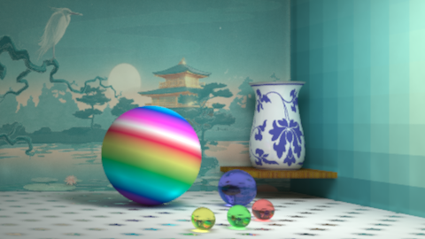

# Computational Graphics - THU Spring 2018


## HW1(10')

实现一个感兴趣的光栅图形学算法

| 基本选题      | 加分项                                                     |
| ------------- | ---------------------------------------------------------- |
| 画线(6')      | SSAA(2'), Kernel(2'), 区域采样(2'), 相交线反走样的case(4') |
| 画弧(8')      | 同上                                                       |
| 区域填充(10') | 边界反走样(2')                                             |

### Result

图太丑了而且这个作业也很trivial就不放图了

## HW2(60')

参数曲线/曲面的三维造形与渲染

- 利用参数曲线/曲面凹一个造型
- 渲染
  - 基本：光线与参数曲线/曲面的求交
  - 其他：光子映射，加速，纹理景深，体积光等等

### Scoring

```
占总评60分，按以下算法得出分值后，和全班一起归一化到70~100作为单项成绩。(负分倒扣, BUG倒扣)

基本功能完整性[-20, 0]: 光线跟踪基本结果，反射折射阴影
实现网格化求交: [-5]	
实现参数曲面求交: [0, 10]: 解方程请写出求解过程，其他请写出迭代过程
算法选型[0, 40]: 需要实现对应效果才为有效
参考基准: PT: 15, DRT: 25, PM: 30, PPM: 30.
DRT请在报告中注明使用的函数
加速[0, 10]: 算法型加速为有效
OpenMP: 2, GPU: 5
景深/软阴影/锯齿/贴图等[0,5]
主观分[-10, 10]: 设计和构图
其他额外效果: 凹凸贴图、体积光等: [5, ?]
```

代码基于 smallpt，实现了路径追踪（PT）和随机渐进式光子映射（SPPM），支持纹理映射、旋转 Bezier 曲面求交及景深，详情可查阅 [hw2/report.pdf](hw2/report.pdf)。

### Compile & Run

```bash
cd hw2/sppm
g++ main.cpp -o render -O3 -fopenmp
```

macOS 自带的 Apple Clang 不支持 `-fopenmp`，可以使用 Homebrew 安装的 GCC：

```bash
/opt/homebrew/bin/g++-15 main.cpp -o render -O3 -fopenmp
```

传入 4 个参数时使用 PT：

```bash
./render 640 480 pt.ppm 10
./render 3840 2160 high-res.ppm 100000
```

传入 7 个参数时使用 SPPM：

```bash
# 宽度 高度 输出前缀 迭代次数 每像素光子数 初始半径 alpha
./render 640 480 sppm_ 100 20 3 0.7
```

SPPM 每轮使用 KD-tree 汇合相机可见点和光子路径，并逐像素更新搜索半径与累计通量。运行过程中会依次输出 `sppm_001.ppm`、`sppm_002.ppm` 等结果；`alpha` 必须位于 `(0, 1]`。可以通过 `OMP_NUM_THREADS=8` 控制 OpenMP 线程数量。

### Result

**Path Tracing**


**Stochastic Progressive Photon Mapping**



upd 191005: branch `balls` has another scenario. Here's the result: (others are `ball_*.png` in the `releases` page)


PS：别只抄我构图，这里有一堆：[https://graphics.cs.utah.edu/trc](https://graphics.cs.utah.edu/trc)

## HW3(30')

图像大作业

1. 基于优化的图像彩色化 Colorization Using Optimization, SIGGRAPH 2004.
2. 内容敏感的图像缩放 Seam Carving for Content-Aware Image Resizing, SIGGRAPH 2007.
3. 无缝图像拼接 Coordinates for Instant Image Cloning, SIGGRAPH 2009.

此处选了第三个选题，实现了MVC和Poisson Image Editing两种算法

### Result

[hw3/MVC/pic/2_6.png](hw3/MVC/pic/2_6.png)

## Other Result

### MashPlant

Please refer to [https://github.com/MashPlant/computational_graphics_2019](https://github.com/MashPlant/computational_graphics_2019) for more details.


## LICENSE

本项目基于Graphics A+ LICENSE，属于MIT LICENSE的一个延伸。

使用或者参考本仓库代码的时候，在遵循MIT LICENSE的同时，需要同时遵循以下两条规则：

1. 如果您有效果图，则**必须**将效果图的链接加入到这个README中，可以以PR或者ISSUE的方式让本仓库拥有者获悉；

2. 如果您在《计算机图形学基础》或者《高等计算机图形学》中拿到了A+的成绩，则**必须**请本仓库拥有者吃饭。
