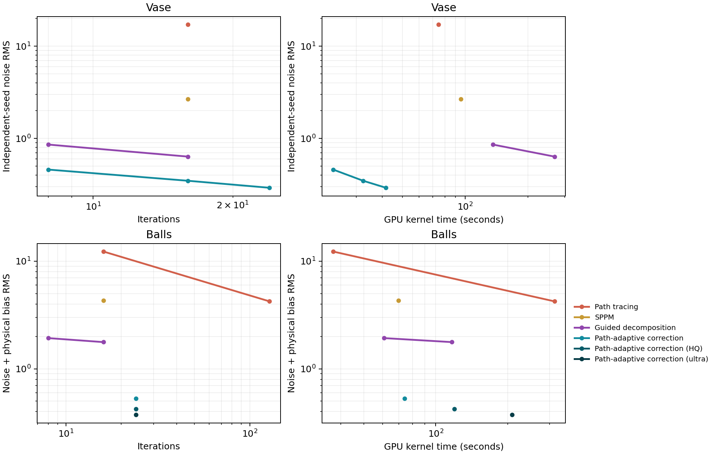
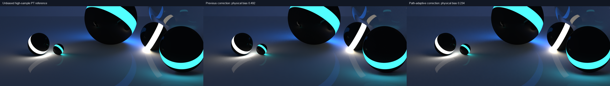
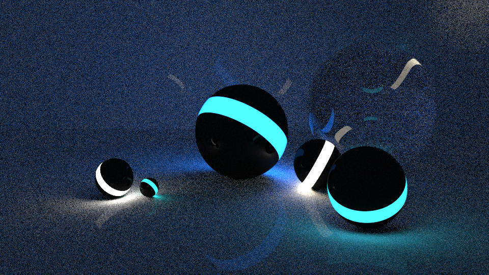
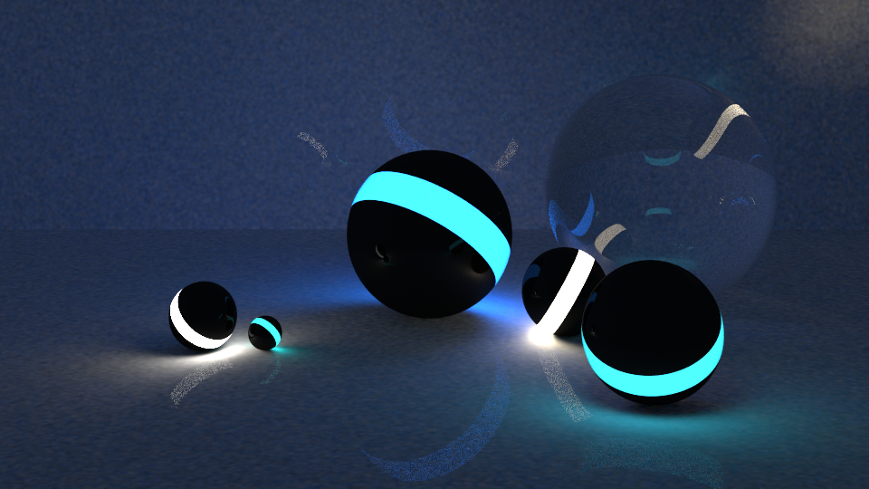
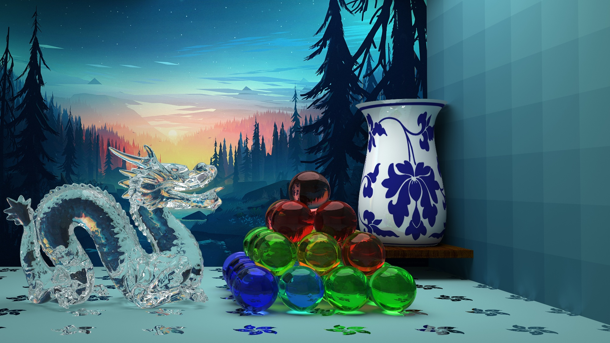
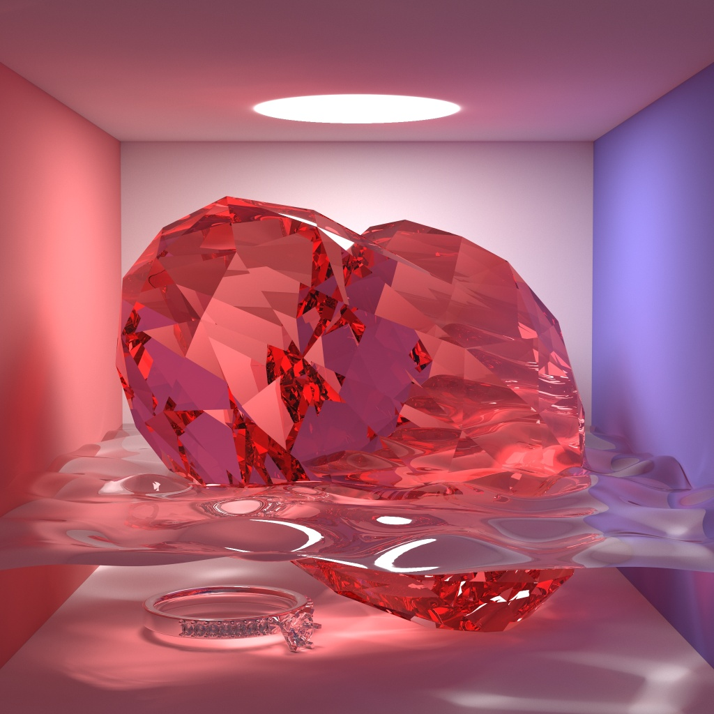

# Computational Graphics - THU Spring 2018


## HW1(10')

实现一个感兴趣的光栅图形学算法

| 基本选题      | 加分项                                                     |
| ------------- | ---------------------------------------------------------- |
| 画线(6')      | SSAA(2'), Kernel(2'), 区域采样(2'), 相交线反走样的case(4') |
| 画弧(8')      | 同上                                                       |
| 区域填充(10') | 边界反走样(2')                                             |

### Result

图太丑了而且这个作业也很trivial就不放图了

## HW2(60')

参数曲线/曲面的三维造形与渲染

- 利用参数曲线/曲面凹一个造型
- 渲染
  - 基本：光线与参数曲线/曲面的求交
  - 其他：光子映射，加速，纹理景深，体积光等等

### Scoring

```
占总评60分，按以下算法得出分值后，和全班一起归一化到70~100作为单项成绩。(负分倒扣, BUG倒扣)

基本功能完整性[-20, 0]: 光线跟踪基本结果，反射折射阴影
实现网格化求交: [-5]	
实现参数曲面求交: [0, 10]: 解方程请写出求解过程，其他请写出迭代过程
算法选型[0, 40]: 需要实现对应效果才为有效
参考基准: PT: 15, DRT: 25, PM: 30, PPM: 30.
DRT请在报告中注明使用的函数
加速[0, 10]: 算法型加速为有效
OpenMP: 2, GPU: 5
景深/软阴影/锯齿/贴图等[0,5]
主观分[-10, 10]: 设计和构图
其他额外效果: 凹凸贴图、体积光等: [5, ?]
```

代码基于 smallpt，实现了 CPU/CUDA 路径追踪（PT）、随机渐进式光子映射（SPPM），以及新的**路径自适应 Guided Hybrid SPPM**。花瓶和玻璃球场景均在 `master`，通过 `--scene vase` / `--scene balls` 切换。课程报告见 [hw2/report.pdf](hw2/report.pdf)。

### 实现内容

- 同时支持 CPU 与 CUDA backend，以及 PT、SPPM、Hybrid SPPM 和路径自适应 Hybrid SPPM。
- 保留原始花瓶和玻璃球的构图、颜色、旋转 Bezier 曲面、彩色纹理、镜面反射、玻璃折射与焦散。
- 支持景深、软阴影、抗锯齿、贴图、凹凸贴图、PBR、色散、体积光和体渲染，均通过参数显式开启。
- 根据实际几何、材质和光路统计自适应采样，不依赖场景名称、物体位置、固定颜色或贴图文件名。

### 直接渲染结果

以下均为 3840×2160 原生 4K 直接渲染，仅将 PPM 无损转换成 PNG，没有调色、改曝光或后期修图。

**花瓶：**


**Balls：**


### 新算法：路径自适应 Guided Hybrid SPPM

传统 PT 容易浪费大量样本寻找光源和焦散；传统 SPPM 擅长处理焦散，但有限光子半径会模糊高光、镜面倒影和材质边界。新算法将光传输积分按实际路径类型拆分：

$$L_o=L_{\mathrm{diffuse,SPPM}}+L_{\mathrm{specular,PT}}+L_{\mathrm{direct,NEE}}.$$

1. **按路径选择估计器。** 漫反射和焦散交给 GPU 光子映射；镜面、玻璃和折射独立使用 PT；可见面积光通过 next-event estimation 直接采样。BSDF 和菲涅耳分支都保留正确概率补偿，因此清晰高光与倒影不会混进光子半径。
2. **减少无效采样。** 对光源功率、材质分支和四维光子发射进行随机化低差异分层；低贡献光子使用带权重补偿的 Russian roulette 提前终止；平面光子查询从 27 个哈希格减少到 9 个。
3. **在原生分辨率复用兼容照明。** 光子半径随分辨率缩小。漫反射先分离纹理反照率，再依据几何位置、法线、材质、实际辐亮度和镜面/折射事件频率复用辐照度，保留纹理、高光、玻璃和镜面细节。
4. **用独立 PT 样本纠正缓存偏差。** 每个像素先以独立 pilot 决定采样预算，再使用另一批原生分辨率 PT 路径估计缓存残差；物体轮廓和纹理、材质边界直接回退到像素自己的光路：

$$\hat L=C+\mathcal U_{\mathrm{compatible}}[P-C].$$

其中 $C$ 是辐照度缓存，$P$ 是同一像素位置的 PT 估计，$\mathcal U$ 仅复用几何和光路行为相容的残差。独立 PT 路径本身无偏；有限光子半径与空间复用仍存在偏差—方差折中，因此不能把最终图像称为完全无偏。

实现见 [hw2/sppm/cuda.cu](hw2/sppm/cuda.cu)，评测脚本见 [hw2/sppm/benchmark.py](hw2/sppm/benchmark.py)。

### 性能与收敛对比

原始 PT 成图来自 GitHub Releases；`100000` 表示每个子像素的路径采样次数。历史图片只有单个结果，且部分使用不同场景版本；噪声通过平坦区域的局部高频残差估计，不能等同于多随机种子的实测 RMS。

| 场景 | 原始 PT 成图 | 分辨率 | 每子像素采样 | 单图噪声估计 |
| --- | --- | --- | ---: | ---: |
| 花瓶 | [nomosaic_16k.png](https://github.com/Trinkle23897/Computational-Graphics-THU-2018/releases/download/result/nomosaic_16k.png) | 7680×4320 | 100000 | 0.215 |
| 花瓶 | [vase_4k_10w.png](https://github.com/Trinkle23897/Computational-Graphics-THU-2018/releases/download/result/vase_4k_10w.png) | 3840×2160 | 100000 | 0.239 |
| Balls | [ball_new_10w.png](https://github.com/Trinkle23897/Computational-Graphics-THU-2018/releases/download/result/ball_new_10w.png) | 3840×2160 | 100000 | 0.477 |
| Balls | [ball_raw.png](https://github.com/Trinkle23897/Computational-Graphics-THU-2018/releases/download/result/ball_raw.png) | 3840×2160 | 未记录 | 0.287 |

下面所有算法都使用一张 NVIDIA H200 实测。随机噪声 $\sigma$ 由独立随机种子估计；系统性偏差 $b$ 对比同场景高采样 PT 参考图；综合误差为 $\sqrt{\sigma^2+b^2}$。GPU 时间只统计 CUDA kernel。

**3840×2160 原生 4K：**

| 场景 | 算法 | 采样 / 轮次 | GPU 时间 | 随机噪声 $\sigma$ | 系统偏差 $b$ | 综合误差 |
| --- | --- | ---: | ---: | ---: | ---: | ---: |
| 花瓶 | PT | 128 / 子像素 | 74.428 s | 17.175 | — | — |
| 花瓶 | SPPM | 16 轮 | 95.526 s | 2.684 | — | — |
| 花瓶 | Guided Hybrid | 16 轮 | 268.420 s | 0.636 | — | — |
| 花瓶 | **路径自适应 Hybrid** | **24 轮** | **41.697 s** | **0.292** | — | — |
| Balls | PT | 128 / 子像素 | 37.225 s | 12.258 | 1.004 | 12.299 |
| Balls | PT | 1024 / 子像素 | 314.161 s | 4.236 | 0.024 | 4.236 |
| Balls | SPPM | 16 轮 | 69.789 s | 4.070 | 1.475 | 4.329 |
| Balls | Guided Hybrid | 16 轮 | 116.867 s | 0.723 | 1.617 | 1.771 |
| Balls | **路径自适应 Hybrid** | **24 轮** | **74.196 s** | **0.460** | **0.265** | **0.531** |
| Balls | **路径自适应 Hybrid HQ** | **24 轮** | **119.768 s** | **0.350** | **0.240** | **0.424** |
| Balls | **路径自适应 Hybrid Ultra** | **24 轮** | **208.575 s** | **0.292** | **0.234** | **0.374** |

普通 SPPM 使用 0.12 的光子半径，与新算法自动选择的 4K 半径一致。花瓶的新算法比 PT 快 **1.78 倍**、比普通 SPPM 快 **2.29 倍**，噪声分别降低 **58.82 倍**和 **9.19 倍**。Balls 标准档比 1024 spp 的 PT 快 **4.23 倍**、噪声降低 **9.21 倍**；比普通 SPPM 多花 6.3% 时间，但综合误差从 4.329 降至 0.531。完整数据见 [docs/render/convergence-4k.csv](docs/render/convergence-4k.csv)。





**640×360，16 轮，四个独立随机种子；PT 对应每子像素 128 次采样：**

| 场景 | 算法 | GPU 时间 | 随机噪声 RMS |
| --- | --- | ---: | ---: |
| 花瓶 | PT | 2.429 s | 17.615 |
| 花瓶 | SPPM | 1.581 s | 3.699 |
| 花瓶 | Hybrid SPPM | 3.527 s | 2.073 |
| 花瓶 | **Guided Hybrid SPPM** | **2.587 s** | **1.800** |
| Balls | PT | 1.078 s | 12.447 |
| Balls | SPPM | 1.341 s | 5.901 |
| Balls | Hybrid SPPM | 2.291 s | 1.379 |
| Balls | **Guided Hybrid SPPM** | **1.367 s** | **0.952** |

**同场景直接渲染效果，960×540：**

| 算法 | 花瓶 | Balls |
| --- | --- | --- |
| PT |  |  |
| SPPM |  |  |
| Guided Hybrid SPPM |  |  |

### 编译与运行

**CUDA backend：**

```bash
nvidia-smi
nvcc --version
cd hw2/sppm

# H100 / H200；A100 使用 sm_80，RTX 4090 使用 sm_89。
nvcc -O3 -arch=sm_90 -std=c++17 cuda.cu -o render-cuda

# 原生 4K 花瓶。
./render-cuda 3840 2160 vase-cache-4k.ppm 24 16 .5 1 \
  --scene vase --nearest --shadow-samples 3 \
  --hybrid-samples 64 --reconstruction-radius 4 --cache

# 原生 4K Balls；与上面的直接渲染图使用相同参数。
./render-cuda 3840 2160 balls-cache-4k.ppm 24 8 .5 1 \
  --scene balls --nearest --hybrid-samples 1536 \
  --reconstruction-radius 4 --cache
```

Balls 的 `--hybrid-samples` 改为 `192`、`576`、`1536`，分别对应标准、HQ 和 Ultra 档。程序按当前工作目录加载贴图；多卡机器可使用 `CUDA_VISIBLE_DEVICES=0` 指定 GPU。

**CPU backend：**

```bash
cd hw2/sppm
# macOS 可先安装 Homebrew GCC，再使用 /opt/homebrew/bin/g++-15。
g++ -O3 -fopenmp main.cpp -o render
./render 640 480 vase-cpu.ppm 32 --scene vase
./render 640 480 balls-cpu.ppm 32 --scene balls
```

**常用功能参数：**

| 功能 | 参数 |
| --- | --- |
| 场景与纹理 | `--scene vase` / `--scene balls`、`--nearest` |
| 路径自适应 Hybrid | `--cache --hybrid-samples 192 --reconstruction-radius 4` |
| 景深 | `--aperture .8 --focus 205` |
| 软阴影 | `--shadow-samples 4 --light-radius 18` |
| 抗锯齿 | `--aa 3` |
| 凹凸贴图 | `--bump 2` |
| PBR | `--pbr --roughness .35 --metallic .2` |
| 色散 | `--dispersion .06` |
| 体积光 | `--medium-density .004 --medium-albedo .8 --anisotropy .5` |
| 体渲染 | `--volume-density .1 --volume-step 1 --volume-emission .5` |
| 自定义相机 | `--camera-origin X,Y,Z --camera-direction X,Y,Z` |

体积光和体渲染不会默认开启；复现原始场景时也不要添加 `--cinematic`。

**复现 4K 评测：**

```bash
python3 -m pip install numpy Pillow scipy matplotlib
python3 benchmark.py --binary ./render-cuda \
  --algorithms pt,sppm --iterations 16 --seeds 0,1,2,3 --photon-radius .12 \
  --width 3840 --height 2160 --gpus 0 --output /tmp/sppm-4k-baselines
python3 benchmark.py --binary ./render-cuda \
  --algorithms cache,cache_hq,cache_ultra --iterations 24 \
  --seeds 0,1,2,3 --width 3840 --height 2160 --gpus 0 \
  --output /tmp/sppm-4k-hybrid
```

添加 `--reference balls=/path/to/converged-balls-pt.png` 可以同时计算相对于高采样 PT 参考图的系统偏差。

PS：别只抄我构图，这里有一堆：[https://graphics.cs.utah.edu/trc](https://graphics.cs.utah.edu/trc)

## HW3(30')

图像大作业

1. 基于优化的图像彩色化 Colorization Using Optimization, SIGGRAPH 2004.
2. 内容敏感的图像缩放 Seam Carving for Content-Aware Image Resizing, SIGGRAPH 2007.
3. 无缝图像拼接 Coordinates for Instant Image Cloning, SIGGRAPH 2009.

此处选了第三个选题，实现了MVC和Poisson Image Editing两种算法

### Result

[hw3/MVC/pic/2_6.png](hw3/MVC/pic/2_6.png)

## Other Result

### MashPlant

Please refer to [https://github.com/MashPlant/computational_graphics_2019](https://github.com/MashPlant/computational_graphics_2019) for more details.






## LICENSE

本项目基于Graphics A+ LICENSE，属于MIT LICENSE的一个延伸。

使用或者参考本仓库代码的时候，在遵循MIT LICENSE的同时，需要同时遵循以下两条规则：

1. 如果您有效果图，则**必须**将效果图的链接加入到这个README中，可以以PR或者ISSUE的方式让本仓库拥有者获悉；

2. 如果您在《计算机图形学基础》或者《高等计算机图形学》中拿到了A+的成绩，则**必须**请本仓库拥有者吃饭。
